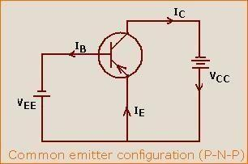

<h2>Apparatus: </h2>

BJT (BC-547B), Bread board,	
resistor (1KΩ, 100KΩ), connecting wires, Ammeters (0‐10mA, 0‐100μ A), DC power supply (0‐30V) and multimeter.

<h2>Theory:</h2>

The transistor is a two junction, three terminal semiconductor device which has three regions namely the emitter region, the base region, and the collector region. There are two types of transistors. An NPN transistor has an N type emitter, a P type base and an N type collector while a PNP transistor has a P type emitter, an N type base and a P type collector. The emitter is heavily doped, base region is thin and lightly doped and collector is moderately doped and is the largest. The current conduction in transistors takes place due to both charge carriers- that is electrons and holes and hence they are named Bipolar Junction Transistors (BJT). BJTs are extensively used in all types of electronic circuits. The aim of this part of the experiment is to familiarize you with the basic modes of operation and features of a BJT. The BJT that you will be using in this experiment is BC 547 (the pin diagram is shown in Fig.), which has a typical current rating of 100 mA (maximum).Two of the most important applications for the transistor are as an amplifier in analog electronic systems, and as a switch in digital systems.

Basic Concepts The operation of the BJT is based on the principles of the PN junction. In the NPN BJT, electrons are injected from the forward-biased emitter into the thin base region where, as minority carriers, they diffuse toward the reverse-biased collector. Some of these electrons recombine with holes in the base region, thus producing a small base current, IB. The remaining electrons reach the collector where they provide the main source of carriers for the collector current, IC. Thus, if there are no electrons injected from the emitter, there will be (almost) no collector current, and, therefore, the emitter current controls the collector current. Combining currents, the total emitter current is given as 
  IE = IB + IC. For normal PNP operation, the polarity of both voltage sources must be reversed.

BJTs are used to amplify current, using a small base current to control a large current between the collector and the emitter. This amplification is so important that one of the most noted parameters of gain, β, is the ratio of collector current to base current.
When the BJT is used with the base and emitter terminals as the input and the collector and emitter terminals as the output, the current gain as well as the voltage gain is large. It is for this reason that this common-emitter (CE) configuration is the most useful connection for the BJT in electronic systems.

<h2>A. Input Characteristics: ‐ </h2>

  It is the curve between input current IB and input voltage VBE at constant collector-emitter voltage VCE. The input characteristic resembles a forward-biased diode curve. After the cut-in voltage, the IB increases rapidly with a small increase in VBE. This means that the dynamic input resistance is small in a CE configuration. It is the ratio of change in VBE to the resulting change in base current at constant collector-emitter voltage. It is given by ΔVBE / ΔIB.

<h2>B. Output Characteristics: ‐ </h2>

  This characteristic shows the relation between collector current IC and collector voltage for various values of base current. The change in collector-emitter voltage causes a small change in the collector current for a constant base current, which defines the dynamic resistance and is given as ΔVCE / ΔIC at constant IB. The output characteristic of a common emitter configuration consists of three regions: Active, Saturation, and Cut-off.

<h3>Active region: </h3>

In this region base‐emitter junction is forward biased and base‐collector junction is reversed biased. The curves are approximately horizontal in this region.
Saturation region: In this region both the junctions are forward biased.

<h3>Saturation region: </h3>

In this region both the junctions are forward biased.

<h3>Cut‐off: </h3>

In this region, both the junctions are reverse biased. When the base current is made equal to zero, the collector current is reverse leakage current. The region below IB = 0 is the called the cutoff region.

<h3>Circuit Diagram: </h3>

