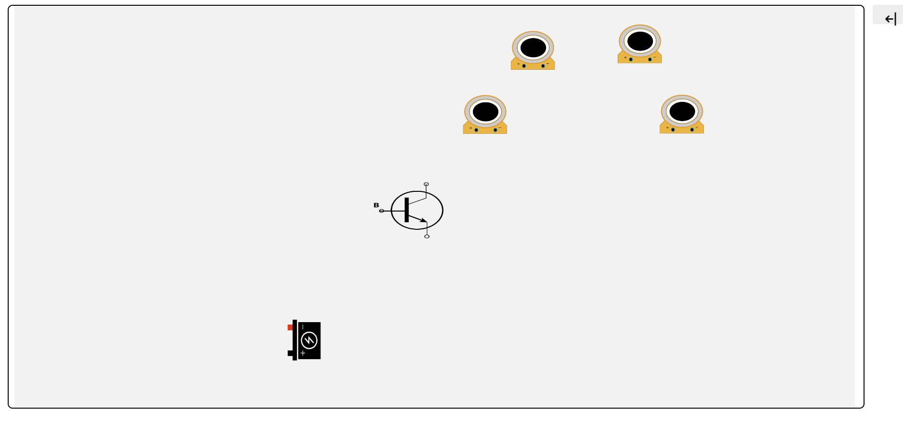
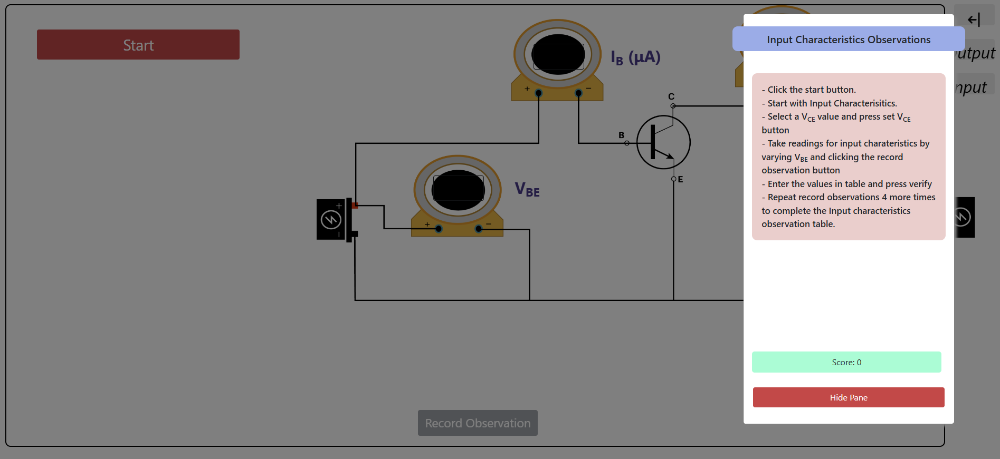
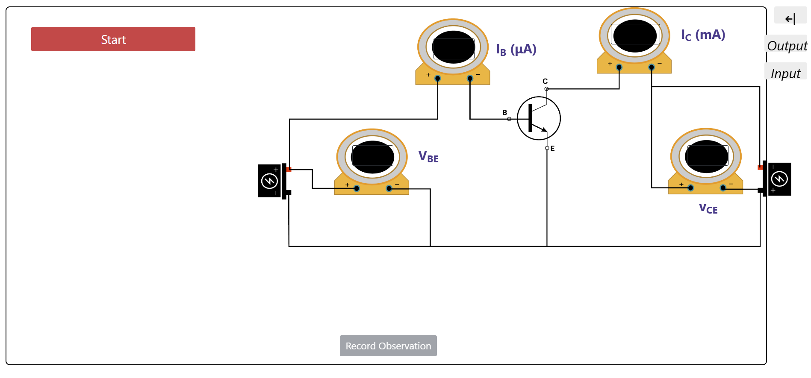
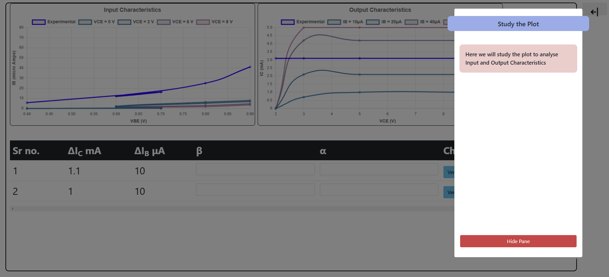
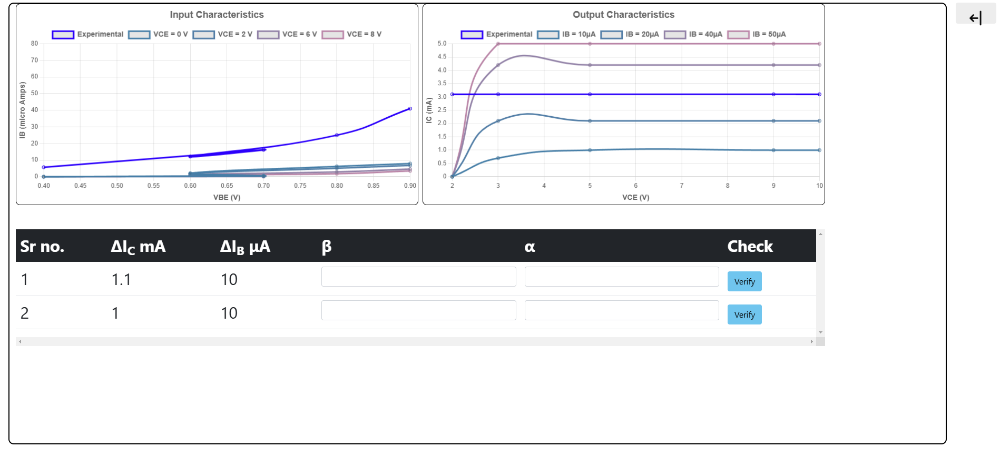
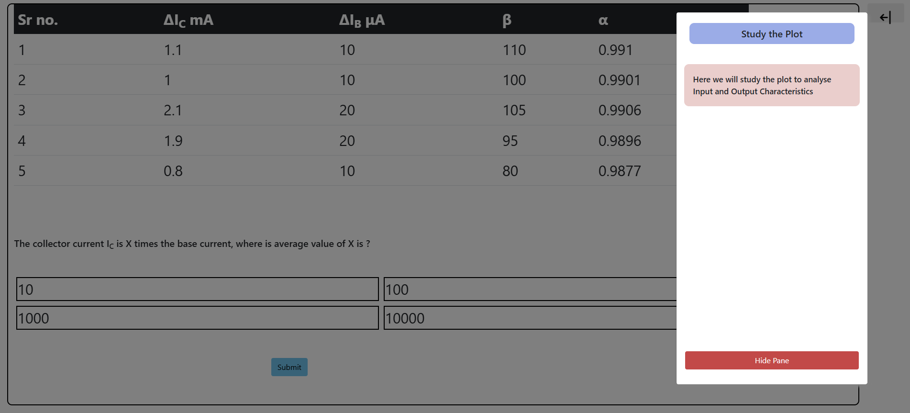

<h2>Procedure: </h2>
<h3>A. Input Characteristics:</h3>
<ol>
  <li>Make the circuit connection as shown in the circuit diagram.</li>
  <li>Set the voltage VCE = 2 V and vary IB with the help of VBB and measure VBE.</li>
  <li>Set the voltage VCE = 3 V and vary IB with the help of VBB and measure VBE.</li>
  <li>Plot a graph of IB vs. VBE.</li>
  <li>Evaluate the dynamic input resistance, which is the ratio of change in VBE to the resulting change in base current at constant collector-emitter voltage. It is given by ΔVBE / ΔIB.</li>
  <li>The reciprocal of the slope of the linear part of the characteristic gives the dynamic input resistance of the transistor.</li>
</ol>
<h3>B. Output Characteristics</h3>
<ol>
  <li>Keep IB constant, say 10 μA, vary VCE and note down the collector current IC.</li>
  <li>Now keep IB = 20 μA, vary VCE and note down the collector current IC.</li>
  <li>Plot a graph of IB vs. VCE.</li>
  <li>The change in collector-emitter voltage causes a small change in the collector current for a constant base current, which defines the dynamic output resistance and is given as ΔVCE / ΔIC at constant IB, or the output conductance is given by ΔIC / ΔVCE with IB at a constant current.</li>
  <li>Find the output conductance from the slope of the linear portion of the characteristic curves and also find the small-signal current gain, which is calculated by β = ΔIC / ΔIB with VCE at a constant voltage.</li>
</ol>
<h3>Calculations:</h3>
<ol>
  <li>Small-Signal Current Gain: β = ΔIC / ΔIB with VCE at a constant voltage.</li>
  <li>Dynamic input resistance: It is given by ΔVBE / ΔIB at constant VCE.</li>
  <li>Dynamic output resistance: It is given as ΔVCE / ΔIC at constant IB.</li>
</ol>

<h3>STEP 1:</h3>

Follow the instructions and identify the components.

<h3>STEP 2:</h3>

Follow the instructions and take reading for Input and Output Characteristics.

<h3>STEP 3:</h3>

Study the plot and verify the values.

<h3>STEP 4:</h3>

Choose the correct options.

